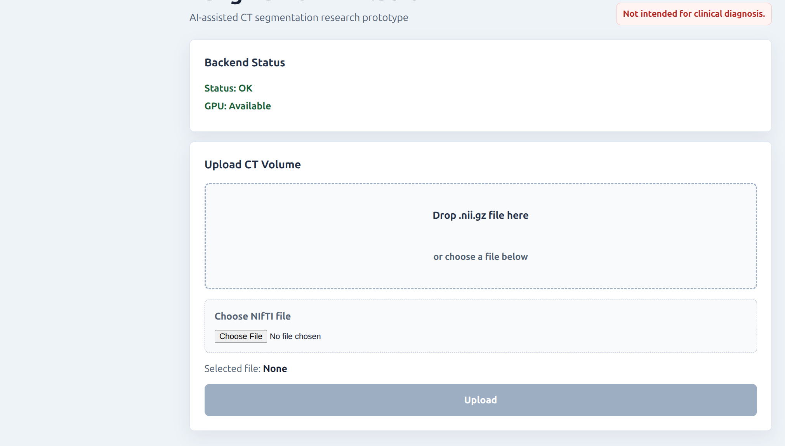
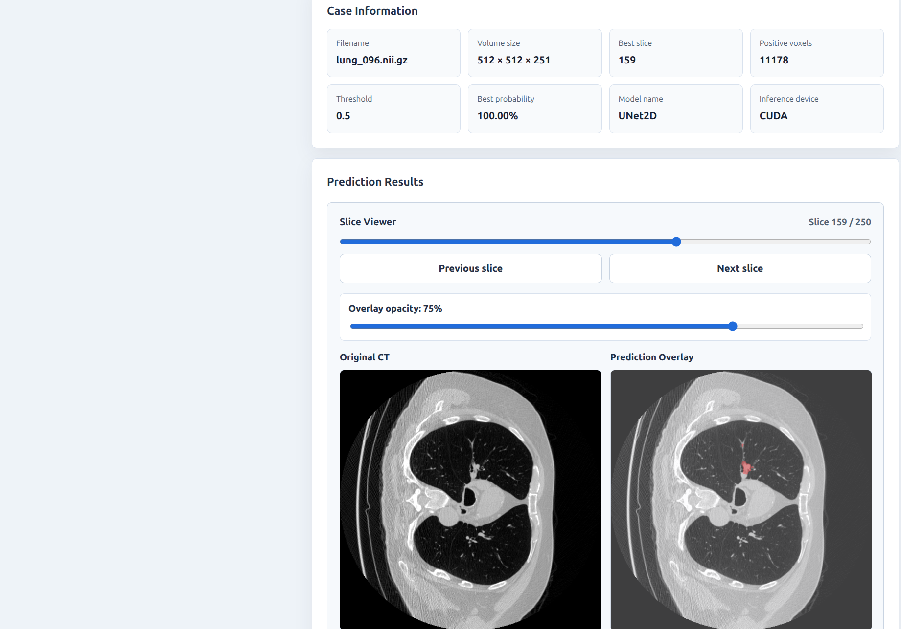
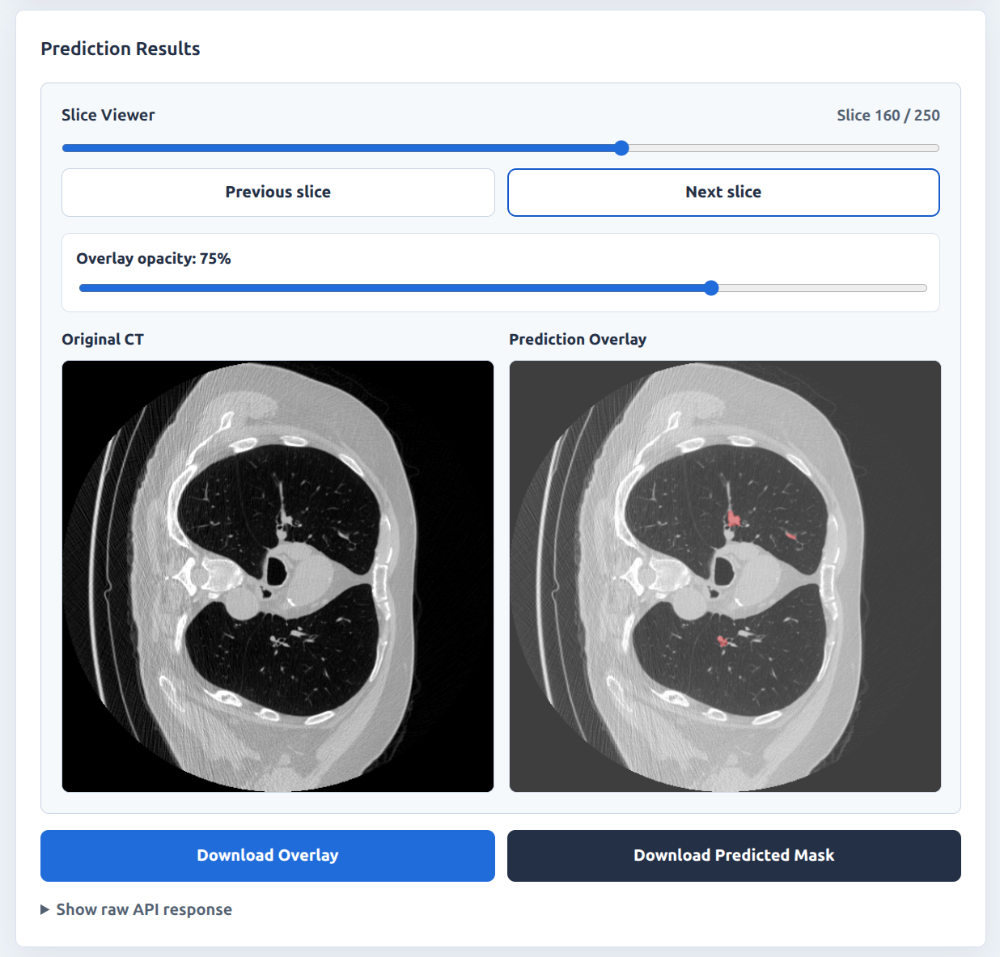
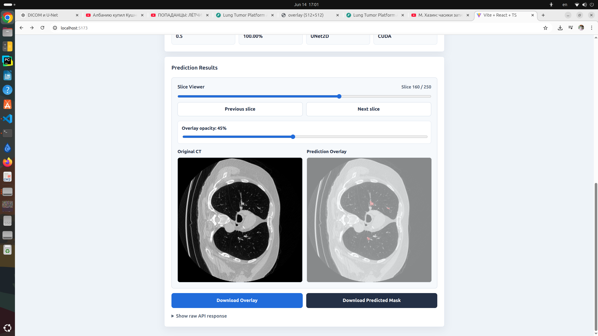

# Lung Tumor Platform

         

AI-powered lung tumor segmentation platform using PyTorch, FastAPI and React.

---

## Project Overview

Lung Tumor Platform is a medical imaging web application for automatic lung tumor segmentation on chest CT scans stored as NIfTI (`.nii.gz`) volumes. It supports full-volume uploads, model inference, and interactive inspection of predicted tumor masks.

The backend uses FastAPI and PyTorch to run deep-learning inference with a trained U-Net model. It processes CT volumes slice by slice, generates a predicted mask, exports PNG visualizations, and exposes results through a REST API.

The React frontend provides an interactive medical image viewer for reviewing results. Users can compare the original CT slice with the prediction overlay side by side, navigate through slices, adjust overlay opacity, preview the CT volume in an interactive VTK.js 3D renderer, reset the VTK camera, and download generated outputs.

The project supports local Docker Compose deployment with CPU inference by default. CUDA inference is supported when running the backend locally in an environment with a compatible NVIDIA GPU and CUDA-enabled PyTorch.

---

## Screenshots

### Home



### Prediction Results



### Slice Navigation



### Download Center



---

## Current Features

- React + TypeScript frontend
- FastAPI backend
- U-Net inference
- NIfTI (`.nii.gz`) upload
- Drag & Drop upload
- Side-by-side CT and overlay viewer
- Slice slider
- Previous / Next navigation
- Overlay opacity control
- VTK.js 3D volume preview
- Reset Camera
- Download overlay
- Download predicted mask
- Docker Compose

---

## Architecture

```text
React + TypeScript
        |
        v
FastAPI
        |
        v
PyTorch U-Net
        |
        v
Predicted Mask
        |
        v
Interactive Viewer
```

---

## Technology Stack

### Backend

- Python
- PyTorch
- FastAPI
- NumPy
- OpenCV
- NiBabel

### Frontend

- React
- TypeScript
- Vite
- VTK.js

### Medical Imaging

- NIfTI
- U-Net

### Deployment

- Docker Compose
- CPU inference in Docker Compose
- CUDA support for local backend inference

---

## Project Structure

```text
lung-tumor-platform/
|-- backend/
|   |-- app/
|   |   |-- api/
|   |   |   `-- routes.py
|   |   |-- models/
|   |   |   `-- unet2d.py
|   |   |-- services/
|   |   |   |-- export_service.py
|   |   |   |-- inference_service.py
|   |   |   `-- model_loader.py
|   |   `-- main.py
|   |-- checkpoints/
|   |-- outputs/
|   |-- uploads/
|   |-- Dockerfile
|   `-- requirements.txt
|-- frontend/
|   |-- src/
|   |   |-- api/
|   |   |   `-- client.ts
|   |   |-- App.css
|   |   |-- App.tsx
|   |   `-- main.tsx
|   |-- Dockerfile
|   |-- package.json
|   `-- vite.config.ts
|-- tools/
|-- docker-compose.yml
`-- README.md
```

---

## Running the Project

### Backend

```bash
cd backend
python -m venv .venv
source .venv/bin/activate
pip install -r requirements.txt
uvicorn app.main:app --reload --host 127.0.0.1 --port 8000
```

Backend API: `http://127.0.0.1:8000`

### Frontend

```bash
cd frontend
npm install
npm run dev
```

Frontend app: `http://127.0.0.1:5173`

### Docker Compose

Docker Compose runs the local stack with CPU inference by default.

```bash
cp .env.example .env
docker compose up --build
```

---

## Future Work

- AWS Free Tier deployment
- VTK.js clipping plane / slice plane
- Cornerstone3D viewer
- DICOM support
- Authentication
- CI/CD with GitHub Actions

---

## License

MIT
